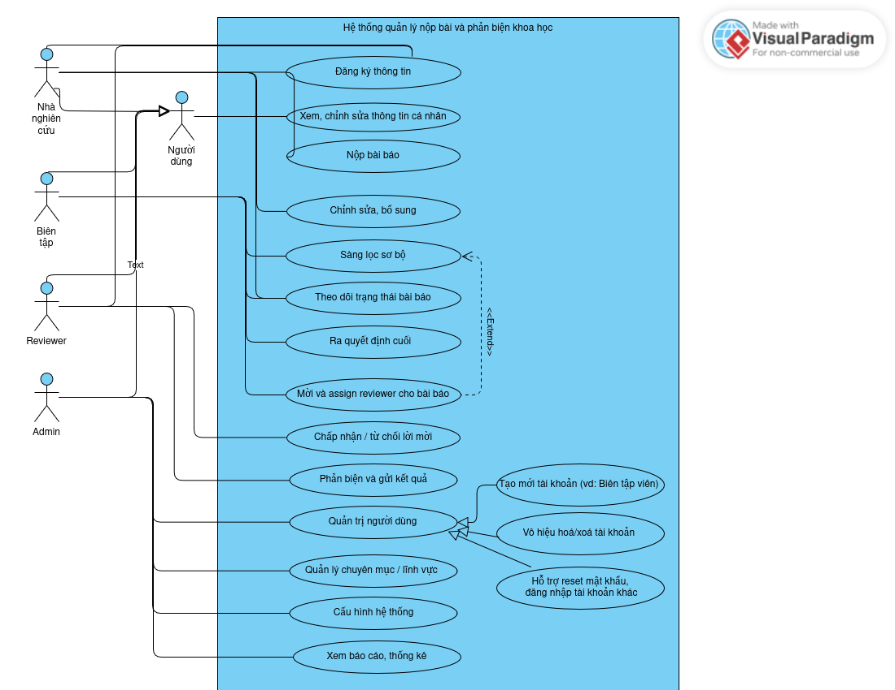
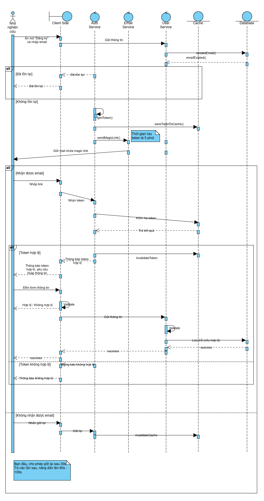

Hệ thống nộp và phản biện bài báo khoa học
===========================================

# Chạy thử nghiệm

Backend:

```bash
cd backend
docker compose up --build -d
```

Frontend:

```bash
cd frontend
yarn && yarn dev
```

# Biểu đồ ca sử dụng



# Flow đăng ký thông tin

